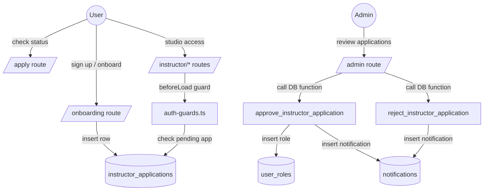
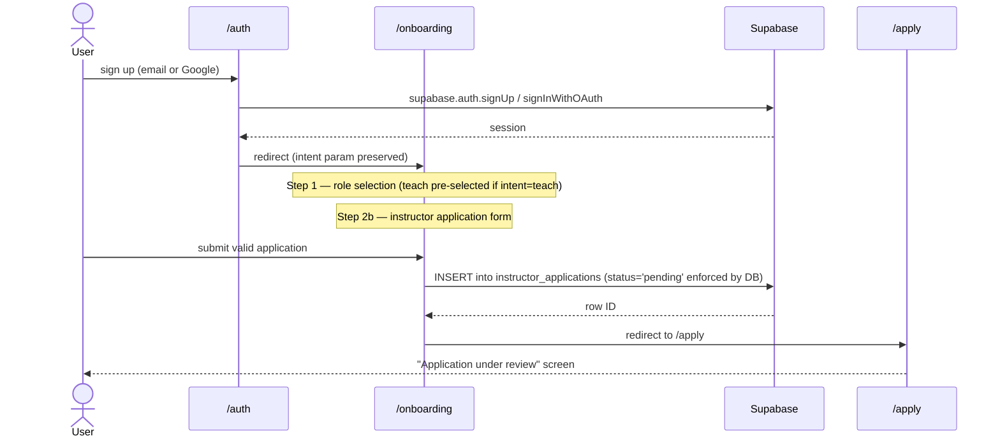
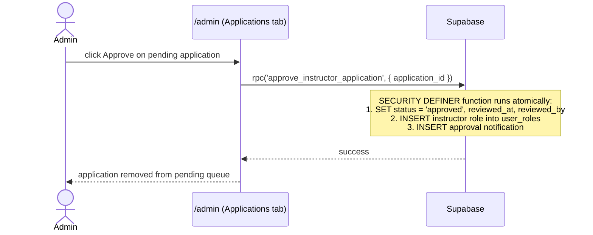

# Design Document: Instructor Onboarding and Screening

## Overview

This feature replaces the current self-serve instructor role grant with a curated application-and-review model. Today, `/teach` and `/onboarding` let any user give themselves the `instructor` role directly via an RLS policy. This design removes that pathway and replaces it with:

1. A branching onboarding flow — students get a 2-step frictionless path, instructor applicants fill a credibility form.
2. A new `instructor_applications` table with server-side-only status transitions.
3. An admin review queue in `/admin` where admins approve or reject applications via SECURITY DEFINER functions.
4. A `/apply` status page for pending/rejected applicants.
5. Updated auth guards that block studio access for pending applicants.

The tech stack is React + TanStack Router + Supabase + TypeScript + Tailwind. All existing patterns (`createFileRoute`, `beforeLoad`, `useQuery`/`useMutation`, the `supabase` client from `@/integrations/supabase/client`) are preserved.

---

## Architecture

### System Context



### Request Flow: New User Signs Up as Instructor Applicant



### Request Flow: Admin Approves



---

## Components and Interfaces

### Route: `/onboarding` — rewritten `src/routes/onboarding.tsx`

**Steps:**

| Step | Name | Shown to |
|------|------|----------|
| 1 | Role selection | Everyone |
| 2a | Student profile (display name + interests) | `intent = 'learn'` |
| 2b | Instructor application form | `intent = 'teach'` |
| 3 | Confirmation / redirect | Everyone |

**beforeLoad guard:** If the user already has `display_name` set in `profiles` AND has no pending application, redirect to `/courses`. If they have a pending application, redirect to `/apply`.

**Search params:** `intent: z.enum(['learn', 'teach']).default('learn')` — same as today.

**Key changes from current implementation:**
- Remove the direct `user_roles` insert for instructor role.
- Replace the instructor profile step with the full application form (expertise, background, portfolio URL, teaching statement).
- After successful application insert, redirect to `/apply` instead of `/instructor`.
- The student path narrows to exactly two steps: role selection → profile (display name + interests) → redirect to `/courses`.

```typescript
// Pseudo-interface for the instructor application form state
interface ApplicationFormState {
  expertise: string;       // max 200 chars, required
  background: string;      // max 1000 chars, required
  portfolioUrl: string;    // optional, must be valid http/https URL if provided
  statement: string;       // min 50 chars, max 2000 chars, required
}
```

### Route: `/apply` — new `src/routes/apply.tsx`

**Purpose:** Status page for instructor applicants. Shows pending / rejected / approved-redirect states.

**beforeLoad guard:** Requires authentication. If user already has instructor role → redirect to `/instructor`. If user has no application → redirect to `/onboarding`.

**Component states:**

| Application status | UI shown |
|---|---|
| `pending` | "Application under review" card with submission date, expected review timeline |
| `rejected` | Rejection reason, earliest reapplication date, reapply button (disabled if within 30-day window) |
| `approved` | Brief "Approved!" flash, then auto-redirect to `/instructor` |

```typescript
// Data shape fetched in the route
interface ApplicationStatus {
  id: string;
  status: 'pending' | 'approved' | 'rejected';
  created_at: string;
  reviewed_at: string | null;
  rejection_reason: string | null;
}
```

### Route: `/admin` — extended `src/routes/admin.tsx`

Adds an **Applications** tab alongside the existing Reviews, Questions, and Courses tabs.

**New component: `ApplicationsMod`**

- Fetches `instructor_applications` joined with `profiles` (display name) and `auth.users` email via a service-role–safe query.
- Renders each pending application as an expandable card showing all submitted fields.
- "Approve" button calls `rpc('approve_instructor_application', { application_id })`.
- "Reject" button opens an inline textarea for optional reason, then calls `rpc('reject_instructor_application', { application_id, reason })`.
- Status filter bar: pending | approved | rejected | all.
- Badge on tab label shows count of pending applications.

```typescript
// Shape of each row returned from the admin query
interface ApplicationRow {
  id: string;
  user_id: string;
  status: 'pending' | 'approved' | 'rejected';
  expertise: string;
  background: string;
  portfolio_url: string | null;
  statement: string;
  rejection_reason: string | null;
  created_at: string;
  reviewed_at: string | null;
  profiles: { display_name: string | null };
  // email joined from auth.users via service_role
  email: string | null;
}
```

### Hook: `useApplicationStatus` — `src/hooks/use-auth.ts`

New export added to the existing hook file:

```typescript
export function useApplicationStatus(userId: string | undefined) {
  // Returns the user's most recent instructor_applications row or null.
  // Uses useQuery from react-query; queryKey: ['application-status', userId].
  // Selects: id, status, created_at, reviewed_at, rejection_reason
}
```

### Auth Guards — `src/lib/auth-guards.ts`

New exported helper:

```typescript
export async function requireNoApplicationPending(userId: string): Promise<void>
// Queries instructor_applications for the user's most recent pending row.
// If one exists, throws redirect({ to: '/apply' }).
// Used in all /instructor/* beforeLoad hooks.
```

Updated `requireRole` to also handle the pending applicant case — instructor routes now call both `requireRole` and `requireNoApplicationPending` in their `beforeLoad`.

---

## Data Models

### New Table: `instructor_applications`

```sql
CREATE TABLE public.instructor_applications (
  id             uuid PRIMARY KEY DEFAULT gen_random_uuid(),
  user_id        uuid NOT NULL REFERENCES auth.users(id) ON DELETE CASCADE,
  status         text NOT NULL DEFAULT 'pending'
                   CHECK (status IN ('pending', 'approved', 'rejected')),
  expertise      text NOT NULL,
  background     text NOT NULL,
  portfolio_url  text,
  statement      text NOT NULL,
  rejection_reason text,
  reviewed_by    uuid REFERENCES auth.users(id),
  reviewed_at    timestamptz,
  created_at     timestamptz NOT NULL DEFAULT now()
);

-- Enforces at-most-one pending application per user
CREATE UNIQUE INDEX instructor_applications_one_pending_per_user
  ON public.instructor_applications (user_id)
  WHERE (status = 'pending');
```

**RLS Policies:**

```sql
ALTER TABLE public.instructor_applications ENABLE ROW LEVEL SECURITY;

-- Users can insert their own applications (status will be forced to 'pending' by DB default)
CREATE POLICY "Users can submit own applications"
  ON public.instructor_applications FOR INSERT TO authenticated
  WITH CHECK (auth.uid() = user_id);

-- Users can read their own applications
CREATE POLICY "Users can read own applications"
  ON public.instructor_applications FOR SELECT TO authenticated
  USING (auth.uid() = user_id);

-- Admins can read all applications
CREATE POLICY "Admins can read all applications"
  ON public.instructor_applications FOR SELECT TO authenticated
  USING (public.has_role(auth.uid(), 'admin'));

-- No UPDATE policy for authenticated role; updates only via SECURITY DEFINER functions
```

### Modified Table: `user_roles`

**Remove:**
```sql
DROP POLICY "Users can grant themselves instructor role" ON public.user_roles;
```

**Add (admin-only INSERT for instructor role):**
```sql
CREATE POLICY "Only admins or service_role can grant instructor role"
  ON public.user_roles FOR INSERT TO authenticated
  WITH CHECK (
    role != 'instructor'
    OR public.has_role(auth.uid(), 'admin')
  );
```

The `service_role` bypasses RLS entirely, so the SECURITY DEFINER functions (called via `supabase.rpc()`) can still insert the instructor role.

### New DB Functions

#### `approve_instructor_application(application_id uuid)`

```sql
CREATE OR REPLACE FUNCTION public.approve_instructor_application(
  application_id uuid
)
RETURNS void
LANGUAGE plpgsql
SECURITY DEFINER
SET search_path = public
AS $$
DECLARE
  app record;
BEGIN
  -- Fetch and lock the application row
  SELECT * INTO app
    FROM instructor_applications
   WHERE id = application_id
     AND status = 'pending'
   FOR UPDATE;

  IF NOT FOUND THEN
    RAISE EXCEPTION 'Application not found or not pending';
  END IF;

  -- 1. Update application status
  UPDATE instructor_applications
     SET status      = 'approved',
         reviewed_at = now(),
         reviewed_by = auth.uid()
   WHERE id = application_id;

  -- 2. Grant instructor role (idempotent via ON CONFLICT DO NOTHING)
  INSERT INTO user_roles (user_id, role)
  VALUES (app.user_id, 'instructor')
  ON CONFLICT (user_id, role) DO NOTHING;

  -- 3. Insert approval notification (best-effort; failure does not abort)
  BEGIN
    INSERT INTO notifications (user_id, type, payload)
    VALUES (
      app.user_id,
      'application_approved',
      jsonb_build_object('studio_url', '/instructor')
    );
  EXCEPTION WHEN OTHERS THEN
    RAISE WARNING 'Notification insert failed for approval of %: %', application_id, SQLERRM;
  END;
END;
$$;
```

#### `reject_instructor_application(application_id uuid, reason text)`

```sql
CREATE OR REPLACE FUNCTION public.reject_instructor_application(
  application_id uuid,
  reason         text DEFAULT ''
)
RETURNS void
LANGUAGE plpgsql
SECURITY DEFINER
SET search_path = public
AS $$
DECLARE
  app record;
  reapply_after timestamptz;
BEGIN
  SELECT * INTO app
    FROM instructor_applications
   WHERE id = application_id
     AND status = 'pending'
   FOR UPDATE;

  IF NOT FOUND THEN
    RAISE EXCEPTION 'Application not found or not pending';
  END IF;

  reapply_after := now() + INTERVAL '30 days';

  -- 1. Update application status
  UPDATE instructor_applications
     SET status           = 'rejected',
         rejection_reason = reason,
         reviewed_at      = now(),
         reviewed_by      = auth.uid()
   WHERE id = application_id;

  -- 2. Insert rejection notification (best-effort)
  BEGIN
    INSERT INTO notifications (user_id, type, payload)
    VALUES (
      app.user_id,
      'application_rejected',
      jsonb_build_object(
        'rejection_reason', COALESCE(NULLIF(reason, ''), 'No reason provided.'),
        'reapply_after',    reapply_after
      )
    );
  EXCEPTION WHEN OTHERS THEN
    RAISE WARNING 'Notification insert failed for rejection of %: %', application_id, SQLERRM;
  END;
END;
$$;
```

### Supabase TypeScript Types

`src/integrations/supabase/types.ts` needs a new `instructor_applications` entry added to `Tables`:

```typescript
instructor_applications: {
  Row: {
    id: string
    user_id: string
    status: 'pending' | 'approved' | 'rejected'
    expertise: string
    background: string
    portfolio_url: string | null
    statement: string
    rejection_reason: string | null
    reviewed_by: string | null
    reviewed_at: string | null
    created_at: string
  }
  Insert: {
    id?: string
    user_id: string
    status?: 'pending' | 'approved' | 'rejected'  // client should not set; DB enforces
    expertise: string
    background: string
    portfolio_url?: string | null
    statement: string
    rejection_reason?: string | null
    reviewed_by?: string | null
    reviewed_at?: string | null
    created_at?: string
  }
  Update: { /* same as Insert but all optional */ }
  Relationships: [ /* user_id → auth.users, reviewed_by → auth.users */ ]
}
```

### Notification Payloads

| type | payload shape |
|---|---|
| `application_approved` | `{ studio_url: '/instructor' }` |
| `application_rejected` | `{ rejection_reason: string, reapply_after: string }` |

The existing `NotificationsBell` component renders all notification types generically, so no changes needed there.

---

## Correctness Properties

*A property is a characteristic or behavior that should hold true across all valid executions of a system — essentially, a formal statement about what the system should do. Properties serve as the bridge between human-readable specifications and machine-verifiable correctness guarantees.*

Property reflection: After analysing all criteria, several were consolidated:
- Properties 1.3 and 1.4 (learn intent → student only, teach intent → student only at signup) are the same invariant and are merged.
- Properties 5.2 / 9.1 (approval notification) and 6.2 / 9.2 (rejection notification) are merged.
- Properties 4.1 and 4.2 (pending applicant blocked from studio) are merged.
- Properties 6.4 and 6.5 (reapplication window) are merged with boundary focus.
- Properties 8.3–8.5 are expressed as distinct DB constraint properties.

### Property 1: Role assignment invariant after sign-up

*For any* new user who completes the onboarding flow regardless of role intent selected ('learn' or 'teach'), the `user_roles` table SHALL contain exactly the `student` role for that user immediately after sign-up. The `instructor` role SHALL NOT be present.

**Validates: Requirements 1.3, 1.4**

---

### Property 2: Application data round-trip

*For any* valid application form submission (expertise, background, portfolio_url, statement), inserting the row and then reading it back SHALL return values identical to what was submitted — no field is truncated, transformed, or lost.

**Validates: Requirements 3.4**

---

### Property 3: New application status is always 'pending'

*For any* INSERT into `instructor_applications` by an authenticated client — regardless of any `status` value the client attempts to supply — the resulting row's `status` field SHALL be `'pending'`.

**Validates: Requirements 3.4, 8.4**

---

### Property 4: At-most-one pending application per user

*For any* user who already has a row in `instructor_applications` with `status = 'pending'`, a second INSERT for that same user with `status = 'pending'` SHALL fail with a unique constraint violation.

**Validates: Requirements 3.6, 8.5**

---

### Property 5: Pending applicant is blocked from all studio routes

*For any* user whose most recent `instructor_applications` row has `status = 'pending'`, any navigation attempt to any route under `/instructor/*` SHALL redirect to `/apply` and SHALL NOT render studio content.

**Validates: Requirements 4.1, 4.2**

---

### Property 6: Approval atomicity — all four fields set together

*For any* pending application approved by any admin user A at time T, the `approve_instructor_application` function SHALL produce: `status = 'approved'`, `reviewed_at = T`, `reviewed_by = A.user_id`, and a row in `user_roles` granting the applicant the `instructor` role — all in a single transaction.

**Validates: Requirements 5.1, 8.6**

---

### Property 7: Approval inserts exactly one notification

*For any* application approval, exactly one row SHALL be inserted into `notifications` with `type = 'application_approved'` and `user_id = applicant.user_id`. If notification insertion fails, the approval transaction SHALL still commit.

**Validates: Requirements 5.2, 9.1, 9.4**

---

### Property 8: Rejection atomicity — all four fields set together

*For any* pending application rejected by any admin user A with any reason R (including empty string), the `reject_instructor_application` function SHALL produce: `status = 'rejected'`, `rejection_reason = R`, `reviewed_at = T`, `reviewed_by = A.user_id` — all in a single transaction.

**Validates: Requirements 6.1, 8.6**

---

### Property 9: Rejection inserts exactly one notification with correct payload

*For any* application rejection with reason R and rejection timestamp T, exactly one row SHALL be inserted into `notifications` with `type = 'application_rejected'` and a payload containing `rejection_reason` (defaulting to a non-empty default message if R is empty) and `reapply_after` equal to T + 30 days.

**Validates: Requirements 6.2, 9.2**

---

### Property 10: Reapplication 30-day cooldown

*For any* rejection timestamp T and reapplication attempt timestamp T':
- IF T' < T + 30 days THEN `canReapply(T, T') = false`
- IF T' ≥ T + 30 days THEN `canReapply(T, T') = true`

Property tests SHALL generate timestamps spanning boundary cases: exactly 30 days, 29d 23h 59m 59s, 30d 0h 0m 1s, and random pairs across a multi-year range.

**Validates: Requirements 6.4, 6.5**

---

### Property 11: URL validation — HTTP/HTTPS accepted, all others rejected

*For any* string S:
- IF S is a syntactically valid HTTP or HTTPS URL THEN `isValidPortfolioUrl(S) = true`
- IF S is empty, lacks a protocol, uses `ftp://` or any non-HTTP(S) protocol, or is an arbitrary alphanumeric string THEN `isValidPortfolioUrl(S) = false`

**Validates: Requirements 3.3, 8 (implicit)**

---

### Property 12: Application row isolation — users cannot read each other's applications

*For any* two distinct authenticated users U1 and U2, a SELECT on `instructor_applications` performed by U1 SHALL NOT return any rows owned by U2 (i.e., rows where `user_id = U2.id`).

**Validates: Requirements 8.3**

---

### Property 13: Applications list sorted reverse-chronologically

*For any* list of pending applications with distinct `created_at` values, the order in which they are rendered in the Admin Applications tab SHALL be strictly descending by `created_at`.

**Validates: Requirements 7.2**

---

### Property 14: Status filter returns only matching applications

*For any* status filter value F ∈ {'pending', 'approved', 'rejected'} applied to the admin applications list, every returned application SHALL have `status = F` and no application with a different status SHALL appear.

**Validates: Requirements 7.7**

---

### Property 15: Pending badge count equals actual pending count

*For any* state of the `instructor_applications` table with N rows having `status = 'pending'`, the badge displayed on the Applications tab label SHALL show exactly N.

**Validates: Requirements 7.6**

---

## Error Handling

| Scenario | Handling |
|---|---|
| User submits application form with empty required fields | Field-level inline validation errors; form not submitted |
| User enters invalid portfolio URL | Inline validation error on that field; form not submitted |
| Application insert fails (e.g., duplicate pending, network error) | `toast.error` with message; user stays on form |
| User with pending app tries to access `/instructor` | `beforeLoad` redirects to `/apply` |
| Approved applicant lands on `/apply` | Auto-redirect to `/instructor` |
| Admin approval RPC fails (e.g., application already processed) | `toast.error("This application has already been reviewed.")` |
| Notification insert failure inside DB function | Logged as WARNING in Postgres; does not abort the main transaction |
| User tries to reapply within 30-day cooldown | Frontend shows "You can reapply after [date]" and disables the form; server-side also validates |
| OAuth flow — intent parameter lost | Onboarding defaults to `intent = 'learn'`; user can manually switch to "I want to teach" |

---

## Testing Strategy

### Unit Tests

Focus on specific examples, edge cases, and pure function logic:

- `isValidPortfolioUrl`: empty string, valid HTTPS URL with path, URL without protocol, `ftp://` URL, random alphanumeric
- `canReapply(rejectedAt, attemptAt)`: exactly 30 days, 29 days 23h, 30 days + 1s
- Application form validation: all fields empty, one required field empty, statement under 50 chars, statement over 2000 chars
- `useApplicationStatus` hook: returns null when no application, returns correct status row
- Admin Applications tab rendering: Approve and Reject buttons present for pending, absent for decided applications
- `/apply` route rendering: pending state shows submission date, rejected state shows reason + reapply date, approved state redirects

### Property-Based Tests

Use **fast-check** (TypeScript PBT library) for the following properties. Each test runs a minimum of 100 iterations.

```typescript
// Tag format: Feature: instructor-onboarding-and-screening, Property {N}: {title}
```

| Property | fast-check generators |
|---|---|
| P1: Role assignment invariant | `fc.constantFrom('learn', 'teach')` for intent; assert only student role present |
| P2: Application data round-trip | `fc.record({ expertise: fc.string({minLength:1}), background: fc.string({minLength:1}), portfolioUrl: fc.option(fc.webUrl()), statement: fc.string({minLength:50}) })` |
| P3: New application status always pending | `fc.record({ expertise: fc.string(), background: fc.string(), statement: fc.string(), status: fc.constantFrom('approved','rejected','pending','anything') })` |
| P4: At-most-one pending per user | Generate two sequential inserts for the same user; assert second throws |
| P5: Pending applicant blocked from studio | `fc.uuid()` for userId; mock DB returning pending status; assert redirect fires |
| P6: Approval atomicity | `fc.uuid()` for applicationId, adminId; assert all four fields set |
| P7: Approval notification count | `fc.uuid()` for applicationId; assert exactly one notification inserted |
| P8: Rejection atomicity | `fc.uuid()` for applicationId; `fc.string()` for reason |
| P9: Rejection notification payload | `fc.string()` for reason; assert payload structure correct |
| P10: Reapplication cooldown | `fc.date()` for rejectedAt; `fc.date()` for attemptAt; verify boundary |
| P11: URL validation | `fc.webUrl()` for valid inputs; `fc.string()` for invalid inputs; `fc.constantFrom('ftp://example.com', 'not-a-url', '')` for known-bad cases |
| P12: Row isolation | Two distinct `fc.uuid()` users; assert cross-user read returns empty |
| P13: Applications sorted reverse-chronologically | `fc.array(fc.record({created_at: fc.date()}), {minLength:2})` |
| P14: Status filter correctness | `fc.constantFrom('pending','approved','rejected')` for filter; `fc.array(...)` of mixed-status applications |
| P15: Pending badge count | `fc.array(...)` of applications with random statuses; count pending; assert badge matches |

### Integration Tests

These require a live or test Supabase instance (use `supabase start` locally):

- RLS: unauthenticated user cannot read `instructor_applications`
- RLS: authenticated user A cannot read user B's applications
- RLS: authenticated user cannot UPDATE status in `instructor_applications` directly
- RLS: old self-grant policy removed — authenticated user cannot INSERT `instructor` role into `user_roles`
- `approve_instructor_application`: verify all four state changes occur in a single call
- `reject_instructor_application`: verify rejection reason stored, notification inserted

### Migration Test

After applying the migration:

- Verify `instructor_applications` table exists with correct columns and constraints
- Verify the unique partial index exists (`WHERE status = 'pending'`)
- Verify old RLS policy `"Users can grant themselves instructor role"` is absent from `pg_policies`
- Verify both SECURITY DEFINER functions exist and are callable
